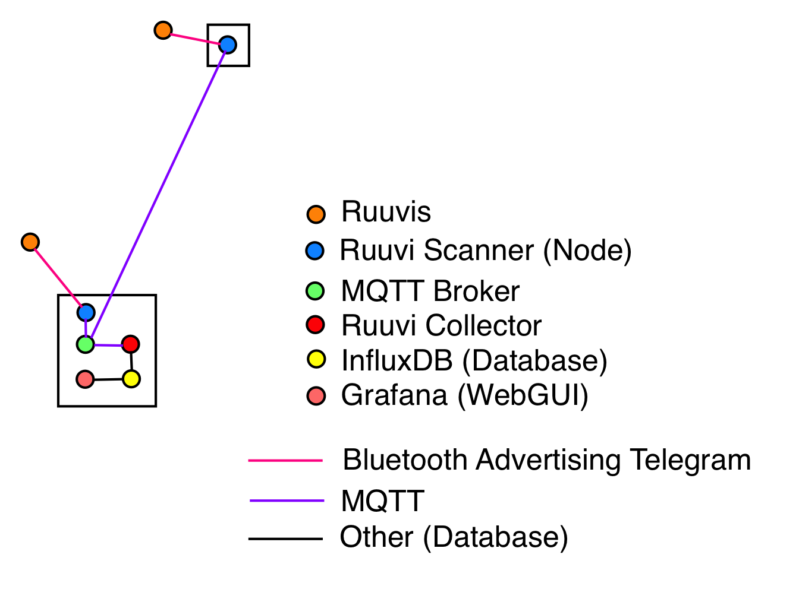
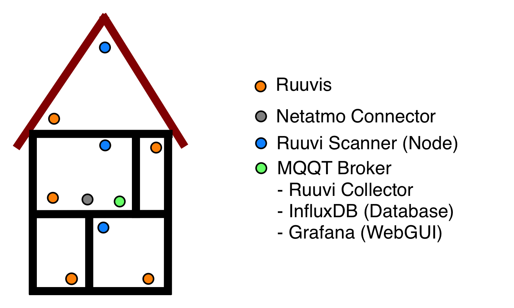

# Distributed Ruuvi Collector

## System Description
Aim of this project is to cover a bigger flat or house with scanning nodes (linux and PyCom WiPy 3 devices) which sends the recorded BLE  telegrams via MQTT to a broker (e. g. Raspberry Pi). Since the format of this MQTT messages looks like the regular "hcidump" raw data format the [RuuviCollector](https://github.com/Scrin/RuuviCollector) can be used out of the box (only two parameters in the configuration have to be changed) for storing the ruuvi telegrams into an [influxDB](https://github.com/influxdata/influxdb)  database. For Visualization of the data, [Grafana](https://grafana.com) can be used. 

The following pictures show the setup:

## Installation
1. Setup the nodes according the documentation in the dedicated folders. 

2. See [Setting up Raspberry Pi 3 as a Ruuvi Gateway](https://blog.ruuvi.com/rpi-gateway-6e4a5b676510) for a detailed description how to setup [RuuviCollector](https://github.com/Scrin/RuuviCollector), [influxDB](https://github.com/influxdata/influxdb) and [Grafana](https://grafana.com).

3. However, to configure the RuuviCollector, the follwing changes have to be made to the config file: "ruuvi-collector.properties"

<pre><code>command.scan=</code></pre>
<pre><code>command.dump=mosquitto_sub -h IP_OF_BROKER -t ruuvis</code></pre>

