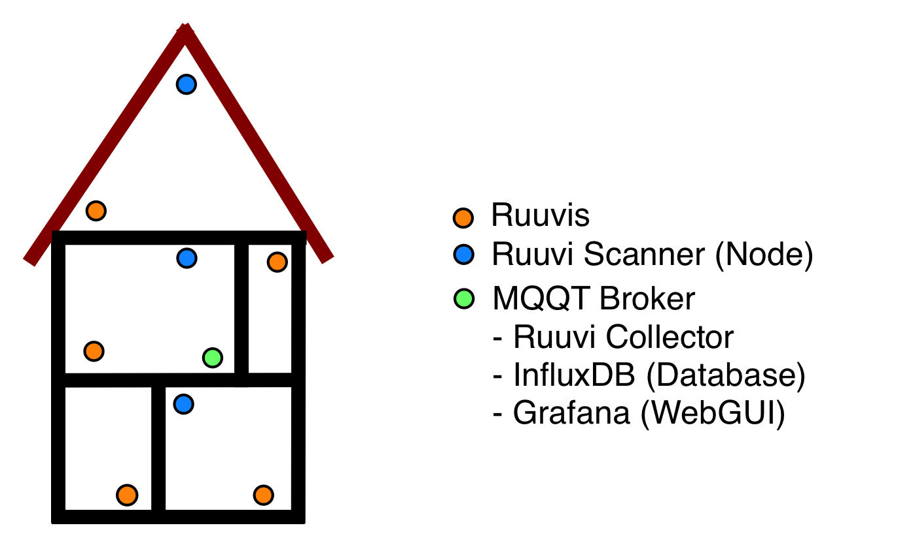

# Distributed Ruuvi Collector

## System Description
Aim of this project is to cover a bigger flat or house with scanning nodes (linux and PyCom WiPy 3 devices) which sends the recorded BLE  telegrams via MQTT to a broker (e. g. Raspberry Pi). Since the format of this MQTT messages looks like the regular "hcidump" raw data format the [RuuviCollector](https://github.com/Scrin/RuuviCollector) can be used out of the box (only two parameters in the configuration have to be changed) for storing the ruuvi telegrams into an [influxDB](https://github.com/influxdata/influxdb)  database. For Visualization of the data, [Grafana](https://grafana.com) can be used. 

The following pictures show the setup:

## Installation
1. Setup the nodes according the documentation in the dedicated folders. 
2. Install MQTT Publisher on the device which should executes the RuuviCollector:
 <pre><code>sudo apt-get install mosquitto-clients=</code></pre>
3. See [Setting up Raspberry Pi 3 as a Ruuvi Gateway](https://blog.ruuvi.com/rpi-gateway-6e4a5b676510) for a detailed description how to setup [RuuviCollector](https://github.com/Scrin/RuuviCollector), [influxDB](https://github.com/influxdata/influxdb) and [Grafana](https://grafana.com).
4. However, to configure the RuuviCollector, the following changes have to be made to the config file: "ruuvi-collector.properties"

<pre><code>command.scan=</code></pre>
<pre><code>command.dump=mosquitto_sub -h IP_OF_BROKER -t ruuvis</code></pre>

## Outlook
This project is not finished, next steps are:
1. As shown in the pictures above a connector for netatmo data has to be developed. Here, I want to add extra code to a copy of the project [netatmo-display](https://github.com/bkoopman/netatmo-display) to reformat the data so that it looks like the raw data telegram of a ruuvi beacon and send everything to the existing setup via MQTT. 
2. Use the sensors of the PySense Board and send MQTT messages in the same way as for the netatmo data in 1. Thus, the sensor data has to be reformatted into the ruvvi raw data BLE advertising telegram format. 
3. Modify the Ruuvi firmware to only transmit telegrams every 10 seconds instead of every second. This should enable longer battery lifetime of the beacons.

